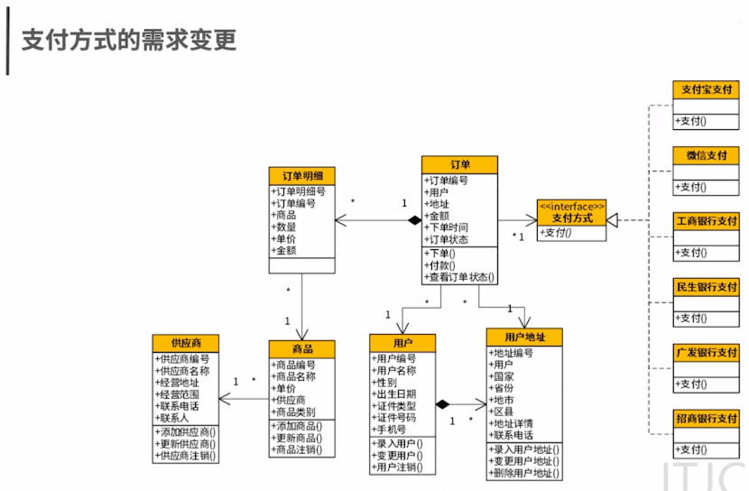
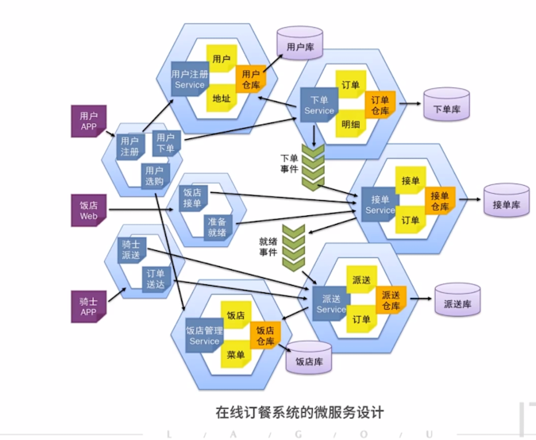
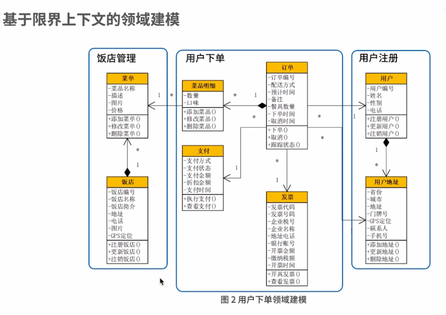
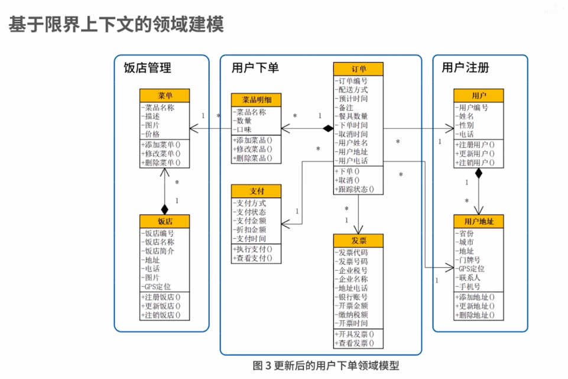
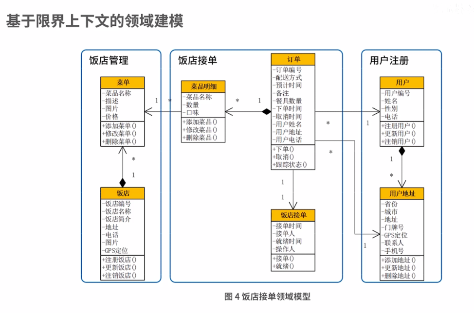

# DDD
DDD领域驱动实践

# 一、开放封闭原则
###开放原则
对于功能扩展是开放的（open for extension）,即当系统需求发生变更时，可以对软件功能进行扩展，使其满足用户新的需求
###封闭原则
对于软件代码的修改是封闭的（close for modification）即在修改软件的同时，不要影响到系统原油的功能，所以应当在不修改原有代码的基础上实现功能

#软件设计
采用领域驱动的方式，在拿到需求以后，应当先进行需求分析，设计领域模型

_单一指责原则_

软件系统中的每个元素只完成自己职责范围内的事而将其他的事交给别人去做，自己只是去调用.
要求在维护软件的过程中需不断的进行调整将软件变化同一个原因的代码放在一起，将软件变化不同原因的代码分开放。

#领域驱动核心的设计思想
将对软件的分析于设计还原到真实世界中，真实世界的业务与问题叫做"问题域"，业务规则与知识叫做"业务领域知识"

#限界上下文
一个复杂系统的领域驱动设计，是以子域为中心进行领域建模绘制会一张一张的领域模型设计。

#单一职责原则
每个限界上下文中实现的都是软件变化同一个原因的业务。
#限界上下文的高内聚
每个限界上下文实现的功能都是软件变化的同一个原因的代码。
很好的将每次的需求变更快速落到某个微服务中变更，实现低成本维护与快速交付快速适应市场变化，提升企业竞争力。
#总结
####1、从DDD开始需求分析、领域建模、逐渐建立起多个问题子域
####2、将问题子域落实到限界上下文，他们之间的关联关系形成上下文地图
####3、各子域落实到微服务中贫血模型或者充血模型的设计，从而在微服务之间依据上下文地图形成接口

##微服务设计的困局是拆分，拆分的核心是"小而专"，"高尔聚"
#如何事件风暴意义
###统一语言建模--指导思想
###事件风暴会议--实践方法
#微服务如何拆分
###拆分指导思想  微服务内高内聚，微服务间低耦合

领域建模就是将一个系统划分成了多个子域，每个子域都是一个独立的业务场景，每个子域的实现就是界限上下文，
他们之间的关联关系是上下文地图

###能够将业务转换为技术
具备超强的业务落地能力，将用户的业务需求落地都技术方案
###能合理利用技术支撑业务
具备广博的知识和开阔的视野，将用户的业务痛点，快速的形成合理的，优秀的技术方案